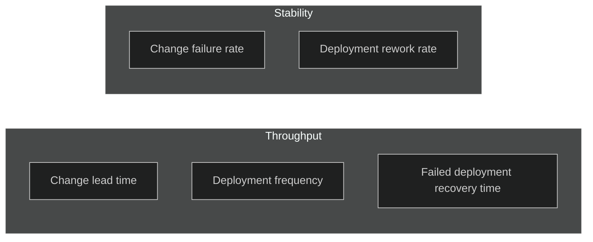
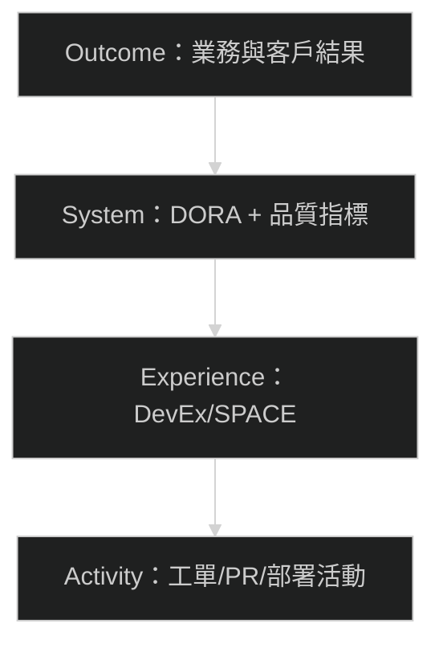

# DevEx 與效能度量（DORA/SPACE）（2026 更新）

度量的目標不是「量化一切」，而是建立可對話的共同語言。DORA 2024 報告將軟體交付效能拆成兩個因子：吞吐量（throughput）與穩定性（stability），並以五項指標來描述交付效能。這讓 Staff 工程師可以用一套可溝通的語言談「速度」與「風險」。 

## DORA 5 指標與兩個因子

1. 變更前置時間（Change lead time）
2. 部署頻率（Deployment frequency）
3. 變更失敗率（Change failure rate）
4. 部署返工率（Deployment rework rate）
5. 失敗部署復原時間（Failed deployment recovery time）

吞吐量（throughput）使用：變更前置時間、部署頻率、失敗部署復原時間。  
穩定性（stability）使用：變更失敗率、部署返工率。

## DORA 因子分解（示意）

## DevEx 三維度（用來解釋「為什麼變慢」）

1. 回饋迴圈（Feedback loops）
2. 認知負荷（Cognitive load）
3. 心流狀態（Flow state）

## SPACE 五維度（用來避免單一指標誤導）

1. Satisfaction（滿意度）
2. Performance（績效）
3. Activity（活動量）
4. Communication & collaboration（溝通與協作）
5. Efficiency & flow（效率與心流）

## 度量堆疊（示意）

## 實作建議

1. 先用 DORA 定義「速度與穩定」的基準線
2. 用 DevEx/SPACE 解釋「為什麼變慢」與「如何改善」
3. 把指標當作對話開頭，而不是績效懲罰工具

## 參考資料

1. DORA Accelerate State of DevOps 2024 報告（下載頁）：https://dora.dev/research/2024/dora-report/
2. DORA Accelerate State of DevOps 2024（研究條目）：https://research.google/pubs/dora-accelerate-state-of-devops-2024-report/
3. SPACE Framework（ACM Queue）：https://queue.acm.org/detail.cfm?id=3454124
4. DevEx: What Actually Drives Productivity（CACM）：https://cacm.acm.org/practice/devex-what-actually-drives-productivity/
5. DevEx in Action（CACM）：https://cacm.acm.org/practice/devex-in-action/
