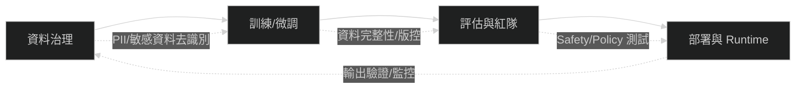

# 生成式 AI / LLM 風險與護欄（2026 更新）

生成式 AI 的導入已經從「功能」轉為「系統性風險」。OWASP LLM Top 10 提供了常見攻擊面，而 NIST SP 800-218A 則把 AI 納入 SSDF 的安全開發實務。Staff 工程師的任務是把「風險清單」轉成「交付護欄」。

## OWASP LLM Top 10（v1.1）

1. LLM01 Prompt Injection（提示注入）
2. LLM02 Insecure Output Handling（輸出處理不安全）
3. LLM03 Training Data Poisoning（訓練資料汙染）
4. LLM04 Model Denial of Service（模型阻斷服務）
5. LLM05 Supply Chain Vulnerabilities（供應鏈弱點）
6. LLM06 Sensitive Information Disclosure（敏感資訊洩漏）
7. LLM07 Insecure Plugin Design（外掛/工具設計不安全）
8. LLM08 Excessive Agency（過度代理與權限濫用）
9. LLM09 Overreliance（過度依賴）
10. LLM10 Model Theft（模型竊取）

## 護欄分層（示意）

## Staff 工程師可以做的事

1. 把 OWASP Top 10 變成安全測試項目與驗收條件
2. 建立評估基準（包括安全與偏誤）並自動化
3. 限制模型權限與工具可用範圍（最小權限）
4. 建立輸出過濾與回應等級（阻擋 / 降級 / 人審）
5. 將 AI 供應鏈納入 SSDF 與 SBOM 流程

## 參考資料

1. OWASP Top 10 for LLM Applications：https://owasp.org/www-project-top-10-for-large-language-model-applications/
2. NIST SP 800-218A（AI 社群檔）：https://www.nist.gov/news-events/news/2024/07/secure-software-development-practices-generative-ai-and-dual-use-foundation

